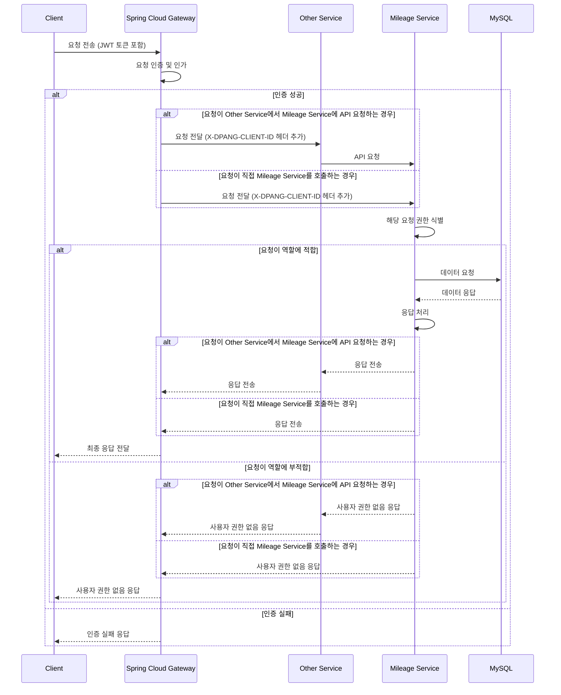
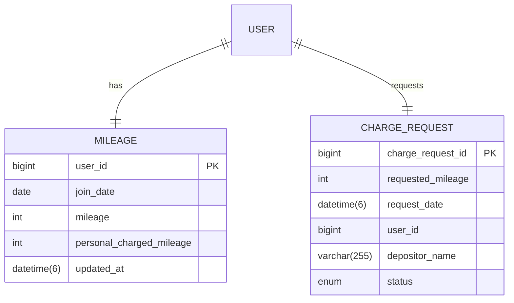

# DPANG MILEAGE SERVER

## 🌐 프로젝트 개요

이 프로젝트는 마일리지 서비스를 지원하는 마이크로서비스로서, 사용자의 마일리지 생성, 조회, 삭제, 소비, 환불, 충전 요청, 충전 요청 조회 및 처리 등의 기능을 제공합니다.

이를 통해 사용자의 마일리지 관련 작업을 효율적으로 관리하고, 사용자 경험을 향상시키는데 중점을 두고 있습니다.

## 🛠️ 프로젝트 개발 환경

### OS 환경

> macOS Sonoma

### 개발 도구

> IDE: Intellij IDEA  
> Java 17

### 빌드 도구

> Gradle

### 주요 플러그인 버전

> Spring Boot: 3.2.1  
> Spring Dependency Management: 1.1.4  
> Kotlin JVM: 1.9.21  
> Kotlin Spring: 1.9.21  
> Kotlin JPA: 1.9.21  
> Kotlin Kapt: 1.8.21

## 🔀 프로젝트 아키텍처

아래의 Sequence Diagram은 본 프로젝트의 주요 컴포넌트인 Spring Cloud Gateway, 타 서비스, 그리고 마일리지 서비스 간의 상호작용을 보여줍니다.



시퀀스 다이어그램을 통해 확인할 수 있듯이, 클라이언트로부터의 요청은 초기 단계에서 Spring Cloud Gateway를 통과하게 됩니다. 이 과정에서 사용자 인증이 이루어지며, 이 인증이 성공적으로 완료되어야만
서비스 요청이 이어집니다.

인증 과정이 정상적으로 마무리되면, 'X-DPANG-CLIENT-ID'라는 사용자 정의 헤더에 사용자의 ID 정보가 포함되어 전달됩니다. 이 헤더는 Mileage 서비스로의 요청에 함께 첨부되어, Mileage
서비스가 요청을 한 사용자를 정확하게 파악할 수 있게 도와줍니다. 이렇게 사용자 식별에 성공한 요청은 적절한 처리 과정을 거친 후, 최종 결과가 반환됩니다.

## 🗃️ 데이터베이스 구조

마일리지 서비스에서 활용하는 데이터베이스(MySQL)는 다음과 같은 구조의 테이블을 가지고 있습니다.



## 📑 API 명세

마일리지 서비스는 다음과 같은 API를 제공합니다:

1. **마일리지 생성**: 회원가입 과정에서 호출되며, 새로 가입한 사용자의 마일리지 정보를 생성합니다. (권한: 사용자 자신, 관리자, 슈퍼 관리자)

2. **마일리지 조회**: 특정 사용자의 마일리지 정보를 조회합니다. (권한: 사용자 자신, 관리자, 슈퍼 관리자)

3. **마일리지 삭제**: 사용자 탈퇴 과정에서 호출되며, 탈퇴하는 사용자의 마일리지 정보를 삭제합니다. (권한: 사용자 자신, 관리자, 슈퍼 관리자)

4. **마일리지 소비**: 사용자의 마일리지를 소비하는 요청을 처리합니다. (권한: 사용자 자신)

5. **마일리지 환불**: 마일리지 환불 요청을 처리합니다. (권한: 사용자 자신, 관리자, 슈퍼 관리자)

6. **마일리지 충전 요청**: 사용자가 마일리지 충전을 요청하는 경우를 처리합니다. (권한: 사용자 자신)

7. **마일리지 충전 요청 조회**: 마일리지 충전 요청 정보를 조회합니다. (권한: 사용자 자신, 관리자, 슈퍼 관리자)

8. **마일리지 충전 요청 처리**: 마일리지 충전 요청을 처리합니다. (권한: 관리자, 슈퍼 관리자)

9. **연간 마일리지 충전**: 연간 1일마다 모든 회원에게 100만 마일리지를 자동으로 충전합니다. (권한: 관리자, 슈퍼 관리자)

10. **분기별 마일리지 충전**: 분기별 (1월, 4월, 7월, 10월) 1일에 모든 회원에게 근속년수 기반으로 마일리지를 자동으로 충전합니다. (권한: 관리자, 슈퍼 관리자)

## 🔬 테스트

프로젝트에서는 다음과 같이 단위 테스트, 통합 테스트 두 가지 방법으로 테스트를 진행하였습니다.

### 단위 테스트

- kotest의 Behavior Driven Development(BDD) 스타일을 적용, 총 22개의 단위 테스트를 수행하였습니다.
- 이 과정에서, 각 메서드가 의도된 기능을 정밀하게 수행하는지, 각각의 결과가 기대한 바와 일치하는지 검증하였습니다.

### 통합 테스트

- 서비스의 여러 컴포넌트가 함께 잘 작동하는지 검증하기 위해 진행하였습니다.
    - 서비스 테스트: 데이터가 정확하게 DB에 저장되는지 및 각 메서드가 의도된 기능을 정밀하게 수행하는지를 확인하기 위해 Junit을 사용하여 총 5개의 테스트를 진행하였습니다.

자세한 내용과 테스트 코드, 그리고 실행 결과는 [여기](./src/test/kotlin/kea/dpang/mileage)에서 확인하실 수 있습니다.

## ✅ 프로젝트 실행

해당 프로젝트를 추가로 개발 혹은 실행시켜보고 싶으신 경우 아래의 절차에 따라 진행해주세요

#### 1. `secret.yml` 생성

```commandline
cd ./src/main/resources
touch secret.yml
```

#### 2. `secret.yml` 작성

```text
spring:
  datasource:
      driver-class-name: com.mysql.cj.jdbc.Driver
      url: jdbc:mysql://{YOUR_DB_HOST}:{YOUR_DB_PORT}/{YOUR_DB_NAME}
      username: {YOUR_DB_USERNAME}
      password: {YOUR_DB_PASSWORD}

  application:
    name: mileage-server

eureka:
  instance:
    prefer-ip-address: true

  client:
    register-with-eureka: true
    fetch-registry: true
    service-url:
      defaultZone: http://{YOUR_EUREKA_SERVER_IP}:{YOUR_EUREKA_SERVER_PORT}/eureka/
```

#### 3. 프로젝트 실행

```commandline
./gradlew bootrun
```

**참고) 프로젝트가 실행 중인 환경에서 아래 URL을 통해 API 명세서를 확인할 수 있습니다**

```commandline
http://localhost:8080/swagger-ui/index.html
```