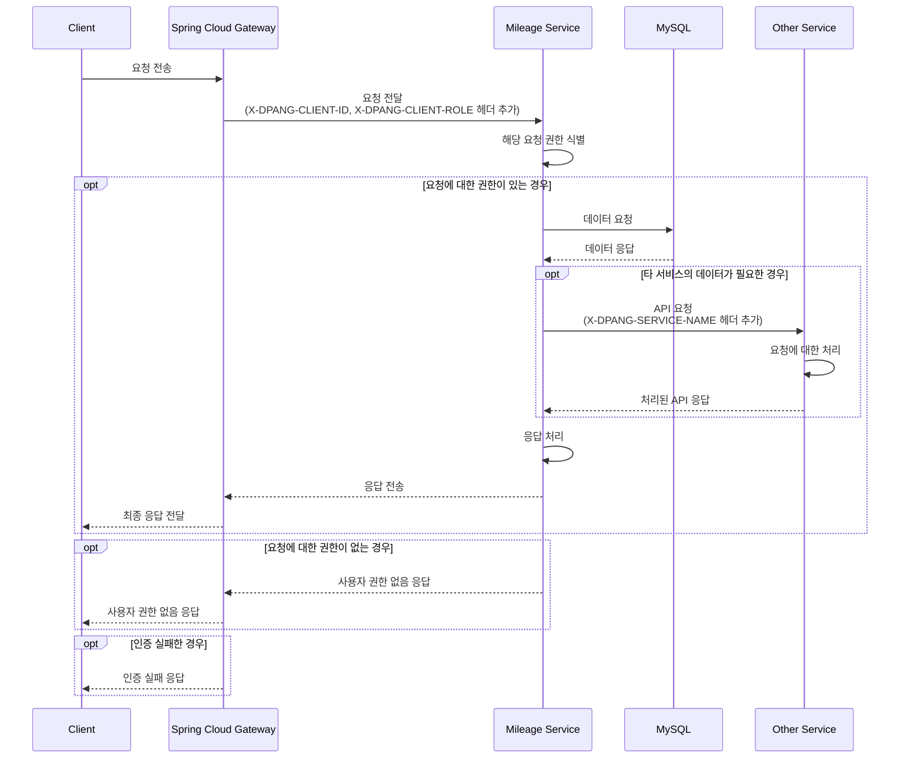
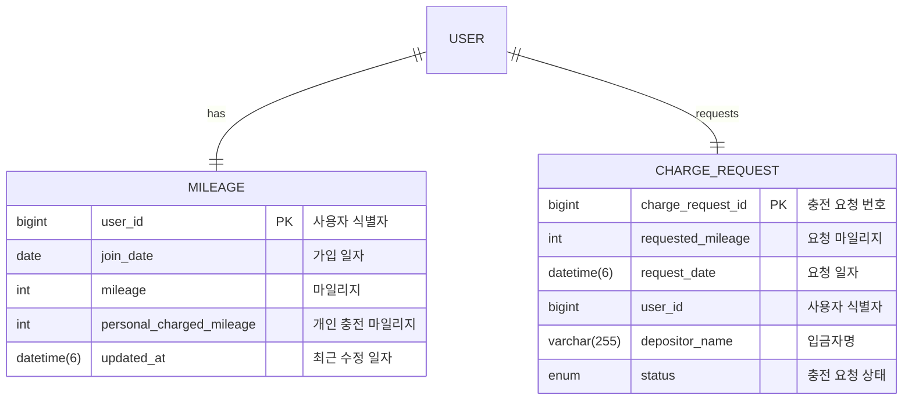

# DPANG MILEAGE SERVER

## 🌐 프로젝트 개요

이 프로젝트는 마일리지 서비스를 지원하는 마이크로서비스로서, 사용자의 마일리지 생성, 조회, 삭제, 소비, 환불, 충전 요청, 충전 요청 조회 및 처리 등의 기능을 제공합니다.

이를 통해 사용자의 마일리지 관련 작업을 효율적으로 관리하고, 사용자 경험을 향상시키는데 중점을 두고 있습니다.

## 🔀 프로젝트 아키텍처



## 🗃️ 데이터베이스 구조

마일리지 서비스에서 활용하는 데이터베이스(MySQL)는 다음과 같은 구조의 테이블을 가지고 있습니다.



## ✅ 프로젝트 실행

해당 프로젝트를 추가로 개발 혹은 실행시켜보고 싶으신 경우 아래의 절차에 따라 진행해주세요

#### 1. `secret.yml` 생성

```commandline
cd ./src/main/resources
touch secret.yml
```

#### 2. `secret.yml` 작성

```yaml
spring:
  datasource:
    driver-class-name: com.mysql.cj.jdbc.Driver
    url: jdbc:mysql://{YOUR_DB_HOST}:{YOUR_DB_PORT}/{YOUR_DB_NAME}
    username: { YOUR_DB_USERNAME }
    password: { YOUR_DB_PASSWORD }

  application:
    name: mileage-server

eureka:
  instance:
    prefer-ip-address: true

  client:
    register-with-eureka: true
    fetch-registry: true
    service-url:
      defaultZone: http://{YOUR_EUREKA_SERVER_IP}:{YOUR_EUREKA_SERVER_PORT}/eureka/
```

#### 3. 프로젝트 실행

```commandline
./gradlew bootrun
```

**참고) 프로젝트가 실행 중인 환경에서 아래 URL을 통해 API 명세서를 확인할 수 있습니다**

```commandline
http://localhost:8080/swagger-ui/index.html
```